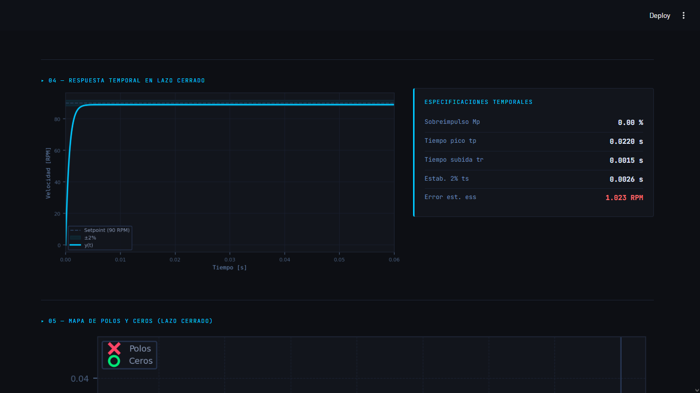

# ⚙ Control de Velocidad — Motor DC + Banda Transportadora

Dashboard interactivo para el análisis y diseño de controladores de velocidad de un motor DC acoplado a una banda transportadora, construido con **Streamlit** y la librería **python-control**.

---

## 📋 Descripción

Este proyecto implementa una interfaz gráfica profesional tipo dashboard de ingeniería para analizar el comportamiento de un sistema de control de velocidad en lazo cerrado. La variable controlada es la velocidad en RPM, medida mediante encoder Hall con retroalimentación unitaria.

El usuario puede seleccionar el modelo de la planta, el tipo de controlador y sus ganancias, y observar en tiempo real cómo cambian la respuesta temporal, las regiones de estabilidad por ganancias, los polos y ceros, el diagrama de Bode y el diagnóstico de estabilidad del sistema.

---

## 🖥 Interfaz

La aplicación se organiza en una sola pantalla sin navegación entre páginas:

| Bloque | Contenido |
|--------|-----------|
| **01 Setpoint** | Slider de referencia de velocidad (60–120 RPM) |
| **02 Configuración** | Selección de modelo de planta y tipo de controlador con campos de ganancia |
| **03 Diagrama de bloques** | Diagrama visual C(s) → G(s) con retroalimentación unitaria |
| **04 Respuesta temporal** | Gráfica al escalón escalada en RPM + especificaciones (Mp, tr, tp, ts, ess) |
| **05 Lugar de las raíces y regiones de estabilidad** | Lugar de raíces para P, planos de estabilidad para PI/PD y vista PID 3D o por plano con una ganancia fija |
| **06 Polos y ceros** | Mapa en el plano complejo con valores numéricos |
| **07 Diagrama de Bode** | Magnitud y fase del lazo abierto L(s) = C(s)·G(s)·H(s) + márgenes |
| **08 Estabilidad** | Diagnóstico por color: estable / crítico / inestable con tabla de polos |

---

## 🔧 Modelos de planta disponibles

**Primer orden (modelo aproximado):**

$$P(s) = \frac{17.4}{0.0583s + 1}$$

**Segundo orden:**

$$P(s) = \frac{4.199}{6.033 \times 10^{-6}s^2 + 0.01374s + 0.2354}$$

---

## 🎛 Controladores disponibles

| Controlador | Función de transferencia | Parámetros |
|-------------|--------------------------|------------|
| **P** | $C(s) = K_p$ | Kp |
| **PI** | $C(s) = K_p + \frac{K_i}{s}$ | Kp, Ki |
| **PD** | $C(s) = K_p + K_d s$ | Kp, Kd |
| **PID** | $C(s) = K_p + \frac{K_i}{s} + K_d s$ | Kp, Ki, Kd |

---

## 📊 Análisis incluidos

- **Respuesta al escalón** en lazo cerrado escalada al setpoint en RPM, con eje temporal adaptativo que ajusta automáticamente el rango para mostrar el transitorio con claridad.
- **Especificaciones temporales:** sobreimpulso Mp (%), tiempo pico tp, tiempo de subida tr, tiempo de establecimiento al 2% ts, y error en estado estacionario ess.
- **Lugar de las raíces y regiones de estabilidad:** barrido de $K_p$ para P, mapas 2D $K_p$-$K_i$ y $K_p$-$K_d$ para PI/PD, y visualización PID en 3D o como plano 2D fijando una de sus ganancias.
- **Mapa de polos y ceros** del sistema en lazo cerrado con valores complejos.
- **Diagrama de Bode** del lazo abierto con margen de fase (PM) y margen de ganancia (GM).
- **Diagnóstico de estabilidad** basado en la parte real de los polos:
  - 🟢 **Estable** — todos los polos con Re < 0
  - 🟡 **Estabilidad crítica** — algún polo con Re ≈ 0
  - 🔴 **Inestable** — algún polo con Re > 0

---

## 🚀 Instalación y ejecución

### Requisitos

- Python 3.9 o superior

### Instalar dependencias

```bash
pip install -r requirements.txt
```

### Ejecutar la aplicación

```bash
streamlit run GUI.py
```

La aplicación se abrirá automáticamente en el navegador en `http://localhost:8501`.

---

## 📁 Estructura del proyecto

```
.
├── GUI.py          # Aplicación principal (única entrada)
└── README.md
```

---

## 📦 Dependencias

| Librería | Uso |
|----------|-----|
| `streamlit` | Interfaz web interactiva |
| `numpy` | Cálculo numérico y vectores de tiempo |
| `matplotlib` | Gráficas embebidas (Bode, escalón, polos/ceros, lugar de raíces, regiones de estabilidad, diagrama de bloques) |
| `control` | Funciones de transferencia, lazo cerrado, respuesta al escalón, márgenes |

---

## 📐 Detalles técnicos

- Todo el análisis se realiza sobre el **sistema en lazo cerrado** $T(s) = \frac{C(s)P(s)H(s)}{1 + C(s)P(s)H(s)}$.
- El diagrama de Bode se calcula sobre el **lazo abierto** $L(s) = C(s)P(s)H(s)$.
- Los márgenes de estabilidad se obtienen con `control.margin()`.
- El eje temporal de la respuesta se ajusta automáticamente estimando $t_s$ con una simulación previa en un rango largo (0–5 s) y añadiendo un 40% de margen visual.
- Las regiones de estabilidad se calculan evaluando los polos del sistema en lazo cerrado para una malla de combinaciones de ganancias; una combinación se marca como estable cuando todos los polos tienen parte real negativa.
- Las ganancias del controlador no tienen límite superior fijo; se ingresan como valores numéricos directamente.

---

## 🖼 Capturas



---

## 📄 Licencia

Este proyecto se distribuye bajo la licencia MIT. Consulta el archivo `LICENSE` para más detalles.
